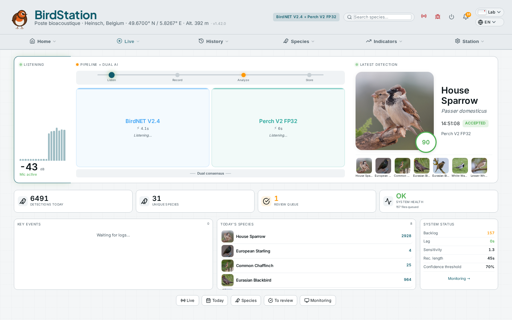
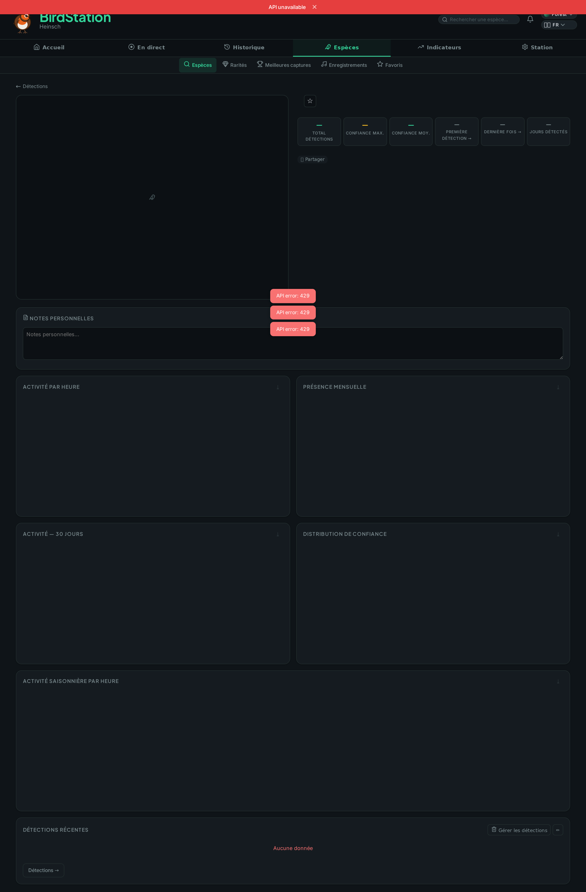
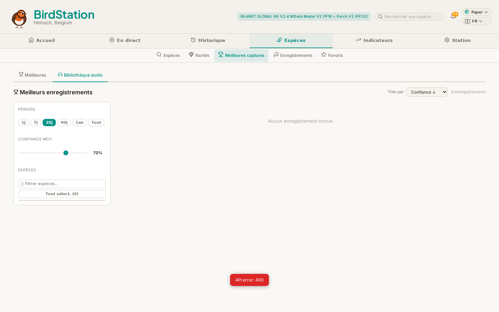
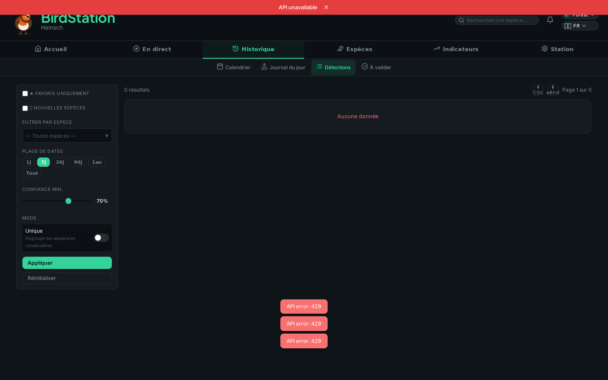
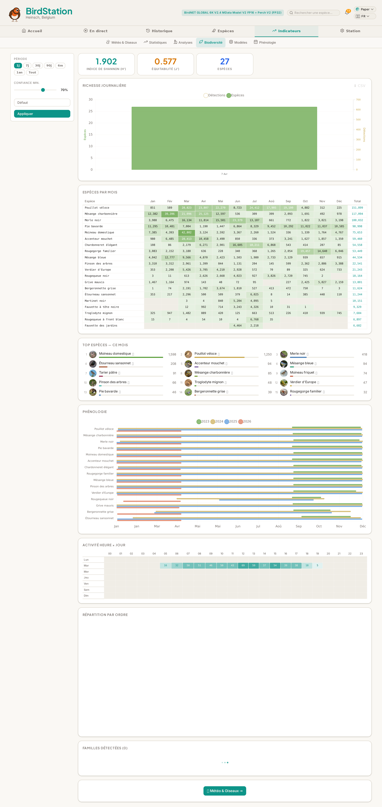
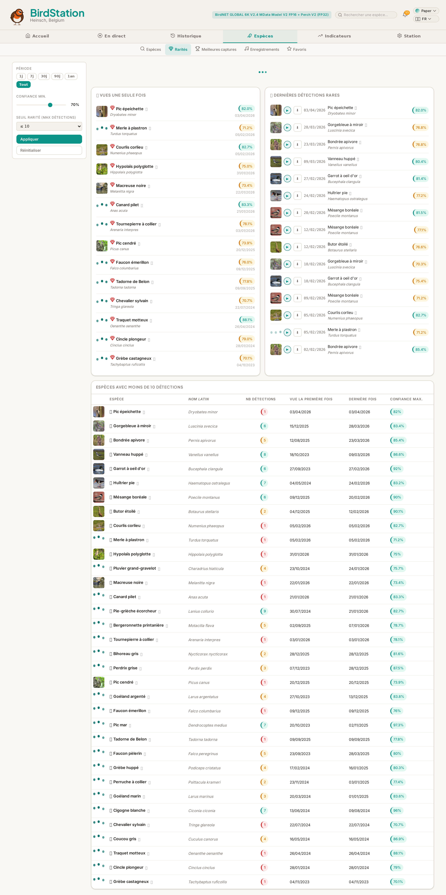
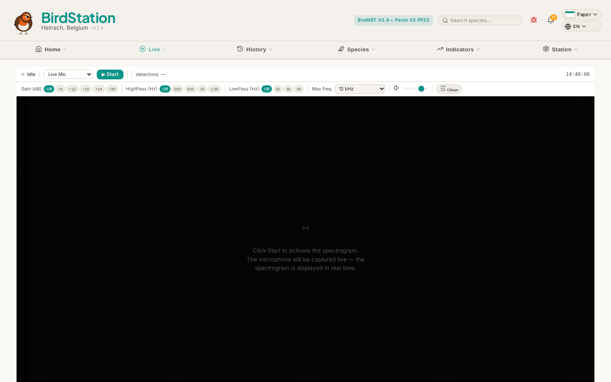
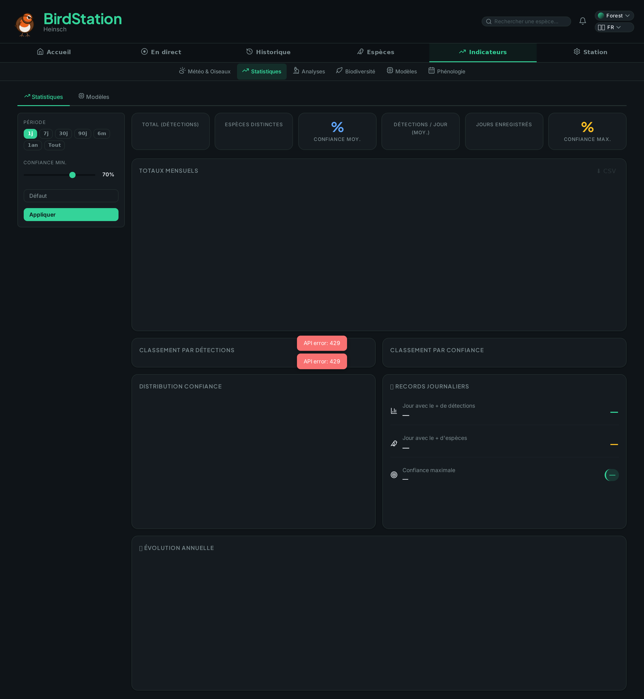

# 🐦 Birdash

[](LICENSE)
[](https://nodejs.org)
[](https://vuejs.org)
[](CONTRIBUTING.md)

Modern ornithological dashboard for [BirdNET-Pi](https://github.com/Nachtzuster/BirdNET-Pi).
Vue 3 (CDN) frontend with Node.js backend, multilingual (FR/EN/NL/DE + 36 languages for species names).

> [Français](README.fr.md) · [Nederlands](README.nl.md) · [Deutsch](README.de.md) · [Contributing](CONTRIBUTING.md)

## Screenshots

| Dashboard | Species Detail |
|:-:|:-:|
|  |  |

| Recordings | Detections |
|:-:|:-:|
|  |  |

| Biodiversity | Rarities |
|:-:|:-:|
|  |  |

| Spectrogram | Statistics |
|:-:|:-:|
|  |  |

## Features

- 📊 Real-time overview with 6 KPIs (detections, species, confidence, total, last hour, rare species today) and charts (today's activity + 7-day trend with trendline)
- 🎙️ Detection feed with integrated audio playback
- 🦜 Detailed species cards with photo carousel (iNaturalist + Wikipedia)
- 🧬 Taxonomy info, IUCN conservation status, wingspan
- 🗓️ Biodiversity matrix (hours × species)
- 💎 Rare species and alerts
- 📈 Statistics and rankings
- 🎵 Audio spectrogram with DSP noise reduction
- 🏆 Best recordings with uniform photos and player
- 🖥️ System status (CPU, RAM, disk, temperature)
- 🔬 Advanced analyses
- ⚡ Service Worker for offline caching
- ♿ Accessibility (WCAG AA, keyboard navigation, skip-link)
- 🎨 5 modern themes (Forest, Night, Paper, Ocean, Dusk)
- 🌍 4 UI languages (FR / EN / NL / DE) + species names auto-translated in 36 languages via BirdNET labels
- 🐦 Automatic species name translation based on selected language (BirdNET l18n label files)

## Prerequisites

- BirdNET-Pi running (`~/BirdNET-Pi/scripts/birds.db` present)
- Node.js >= 18 (`node --version`)
- Caddy (see Caddy Configuration section below)

## Installation

```bash
# 1. Clone the repository
cd ~
git clone https://github.com/ernens/Birdash.git birdash

# 2. Install dependencies
cd ~/birdash
npm install

# 3. Local configuration
cp birdash-local.example.js birdash-local.js
nano birdash-local.js

# 4. Test the server
node bird-server.js
# -> [BIRDASH] API started on http://127.0.0.1:7474
# Test: curl http://127.0.0.1:7474/api/health

# 5. Run tests
npm test

# 6. Install systemd service
sudo cp birdash-api.service /etc/systemd/system/
sudo systemctl edit birdash-api
#    [Service]
#    Environment=EBIRD_API_KEY=your_key
#    Environment=BW_STATION_ID=your_station
sudo systemctl daemon-reload
sudo systemctl enable birdash-api
sudo systemctl start birdash-api
```

## Caddy Configuration

Birdash uses Caddy as a reverse proxy to serve the API, audio files,
and static pages under a single `/birds/` path.

### 1. Install Caddy (if not already installed)

```bash
sudo apt install -y debian-keyring debian-archive-keyring apt-transport-https
curl -1sLf 'https://dl.cloudsmith.io/public/caddy/stable/gpg.key' | sudo gpg --dearmor -o /usr/share/keyrings/caddy-stable-archive-keyring.gpg
curl -1sLf 'https://dl.cloudsmith.io/public/caddy/stable/debian.deb.txt' | sudo tee /etc/apt/sources.list.d/caddy-stable.list
sudo apt update
sudo apt install caddy
```

### 2. Configure the Caddyfile

Edit `/etc/caddy/Caddyfile` and add the Birdash block:

```
YOUR_HOSTNAME {
    encode zstd gzip

    # API: proxy to Node.js backend
    handle /birds/api/* {
        uri strip_prefix /birds
        reverse_proxy 127.0.0.1:7474
    }

    # Audio: extracted audio files from BirdNET-Pi
    handle /birds/audio/* {
        uri strip_prefix /birds/audio
        root * /home/{USER}/BirdSongs/Extracted
        file_server
    }

    # Static dashboard pages
    handle /birds* {
        root * /home/{USER}/birdash
        file_server
    }
}
```

Replace `{USER}` with your system username.

### 3. Apply

```bash
caddy validate --config /etc/caddy/Caddyfile
sudo systemctl reload caddy
```

## Verification

```bash
# Test the API
curl http://127.0.0.1:7474/api/health

# Run backend tests (19 tests)
npm test

# Open the dashboard
# http://YOUR_HOSTNAME/birds/
```

## Project Structure

```
Birdash/
├── bird-server.js           # Node.js HTTP backend (API + SQLite)
├── bird-server.test.js      # Backend tests (19 tests)
├── bird-config.js           # Central configuration
├── bird-vue-core.js         # Vue 3 composables (BirdashShell, i18n, themes)
├── bird-styles.css          # Global styles + 5 themes
├── bird-pages.css           # Page-specific styles
├── sw.js                    # Service Worker (offline cache)
├── birdash-local.example.js # Local config template
├── birdash.service          # systemd service
├── index.html               # Main dashboard
├── species.html             # Species detail (carousel, stats, charts)
├── recordings.html          # Best recordings
├── detections.html          # Detection journal
├── biodiversity.html        # Biodiversity matrix
├── rarities.html            # Rare species
├── stats.html               # Statistics
├── analyses.html            # Advanced analyses
├── spectrogram.html         # Audio spectrogram
├── today.html               # Today's detections
├── recent.html              # Recent detections
├── system.html              # System status
├── screenshots/             # Application screenshots
├── CONTRIBUTING.md          # Contribution guide
└── LICENSE                  # MIT License
```

## Environment Variables

| Variable | Default | Description |
|----------|---------|-------------|
| `BIRDASH_PORT` | `7474` | API server port |
| `BIRDASH_DB` | `~/BirdNET-Pi/scripts/birds.db` | SQLite database path |
| `EBIRD_API_KEY` | — | eBird API key (optional) |
| `BW_STATION_ID` | — | BirdWeather station ID (optional) |

## Security

- 🛡️ Rate limiting: 120 requests/min per IP
- 🔒 Strict SQL validation (read-only, no multi-statements)
- 🔐 Security headers (X-Content-Type-Options, X-Frame-Options, Referrer-Policy)
- 🌐 CORS restricted to configured origins
- ✅ SRI (Subresource Integrity) on CDN scripts
- 🧹 XSS protection (HTML escaping)
- 🙈 SQL error details masked in API responses

## Contributing

Contributions are welcome! See the [contribution guide](CONTRIBUTING.md).

## Updating

```bash
cd ~/birdash
git pull
npm install
sudo systemctl restart birdash-api
```

## License

[MIT](LICENSE) © ernens
